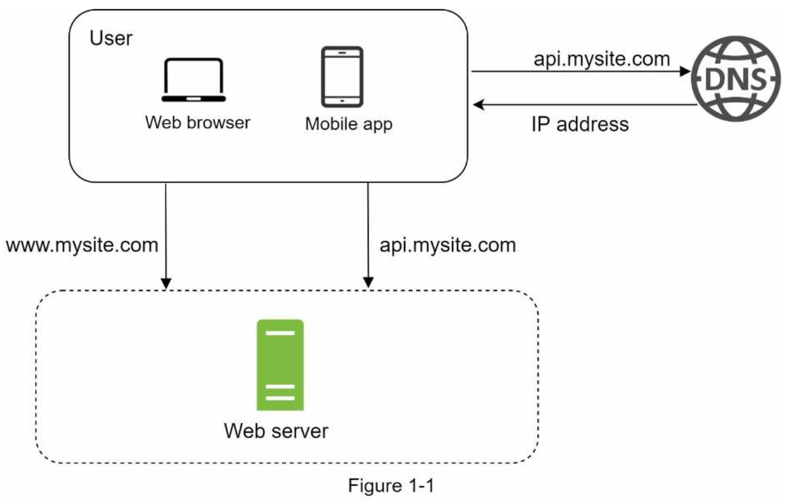
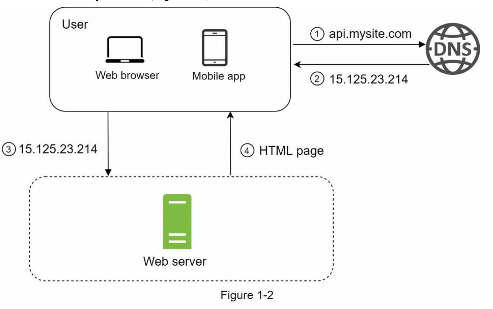

# Chapter 1: SCALE FROM ZERO TO MILLIONS OF USERS

Designing scalable systems is challenging because it is a journey that 
involves continuous improvements and endless refinements.

In this chapter, we design a system that supports a single user and gradually scale it up
to support millions of users.

## Single Server Setup
A journey of a thousand miles begins with a single step, and building a complex system 
is no different. To start with something simple, everything is running on a single server
web app, database, cache, etc.

#### Request Flow and Traffic Source
To understand this setup well, let us examine the flow of the request and where the system traffic comes from.

#### Request flow:
1. Websites are accessed through Domain Names e.g _api.mysite.com_ .
2. After that an IP is returned to the web browser or the mobile app. The IP is always associated with the domain name and resolved by the DNS(Domain Name System)
3. Once the IP address has been obtained HTTP requests are sent directly to the web server to request for the resources.
4. The web server then returns HTML pages or JSON response to be rendered on the browser or the app.

#### Sources of Traffic:
The traffic in this setup comes from two sources: **_web browser_** and the _**mobile app**_.

## Database
As the user base grows, we need multiple servers to cope with the growing traffic since one server will be overwhelmed.

We have one for the **_web/mobile traffic_** and another one for the **_database_**. Separating the web/mobile and database servers allows them to be **_scaled_** independently.

### Databases to Use
