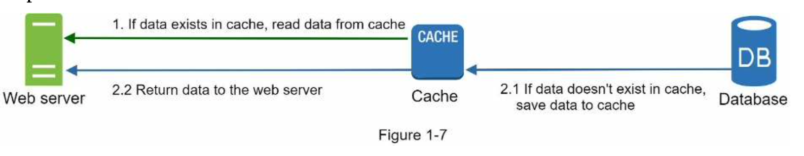
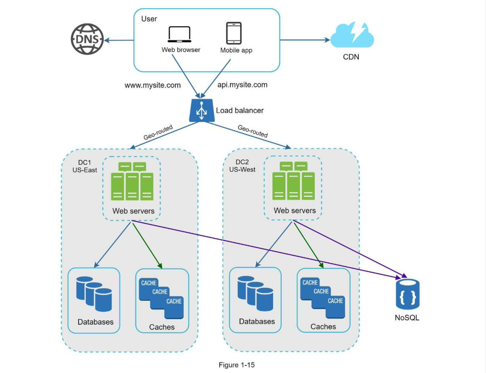
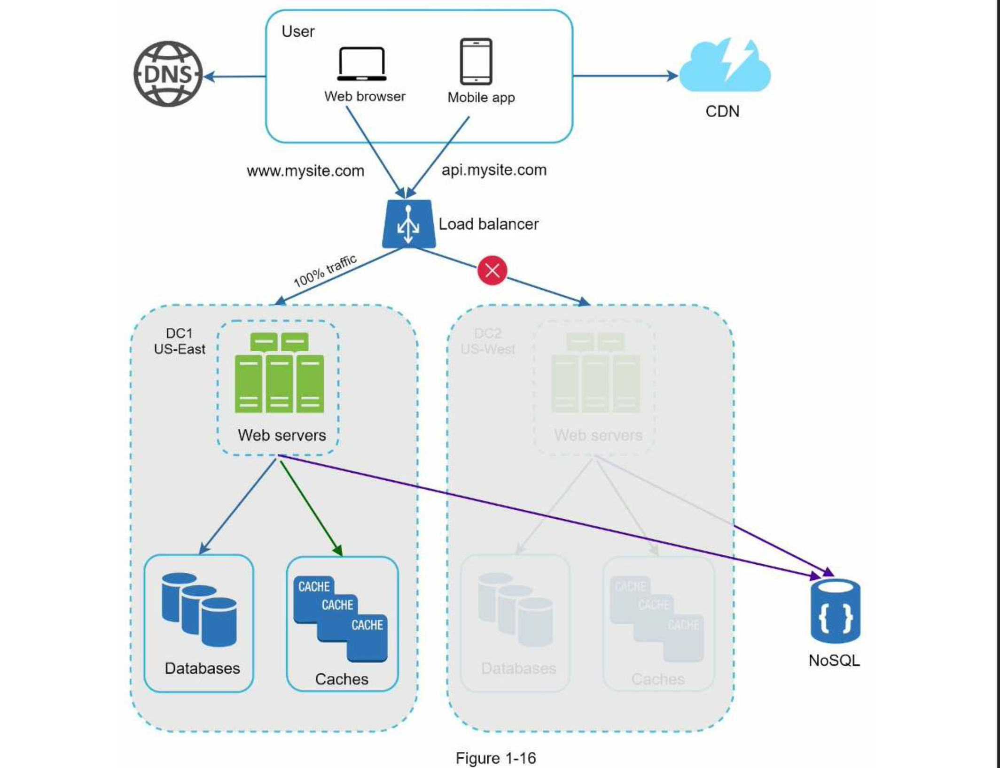
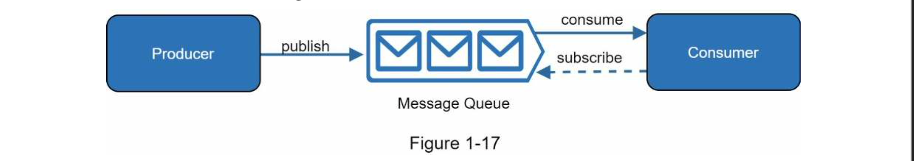
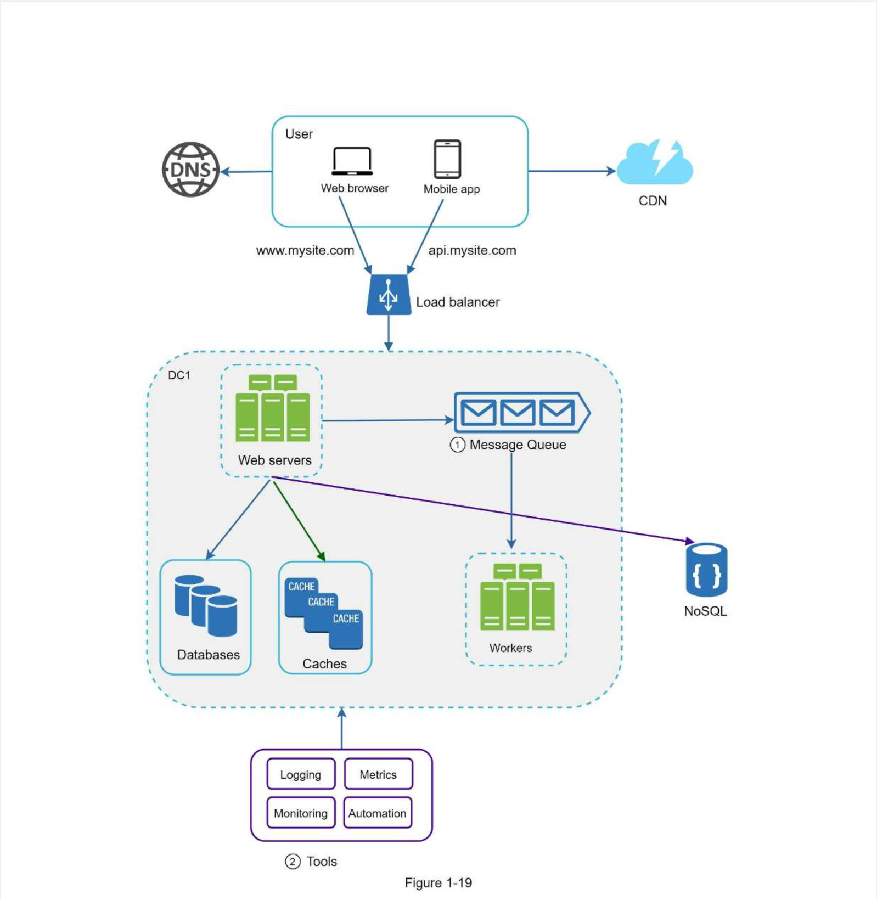
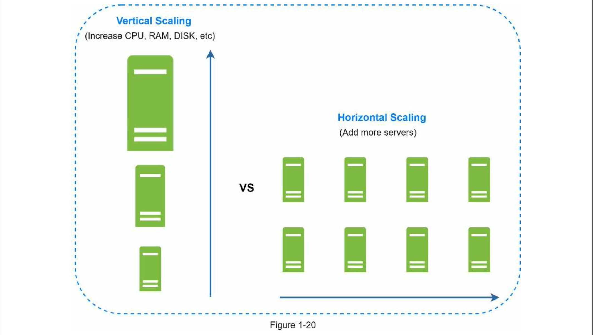
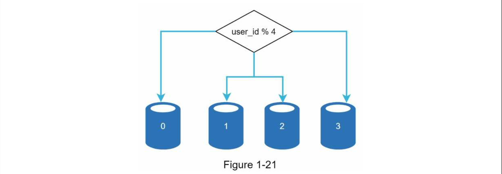
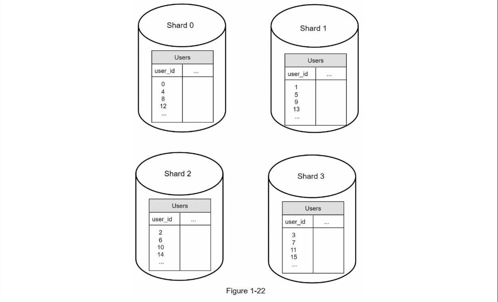
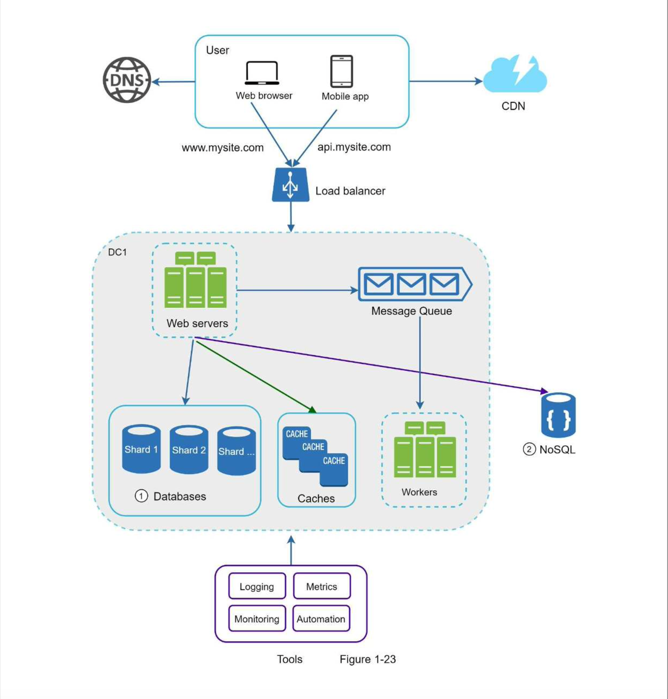

# Chapter 1: SCALE FROM ZERO TO MILLIONS OF USERS

Designing scalable systems is challenging because it is a journey that 
involves continuous improvements and endless refinements.

In this chapter, we design a system that supports a single user and gradually scale it up
to support millions of users.

## Single Server Setup
A journey of a thousand miles begins with a single step, and building a complex system 
is no different. To start with something simple, everything is running on a single server
web app, database, cache, etc.

#### Request Flow and Traffic Source
To understand this setup well, let us examine the flow of the request and where the system traffic comes from.

#### Request flow:
1. Websites are accessed through Domain Names e.g _api.mysite.com_ .
2. After that an IP is returned to the web browser or the mobile app. The IP is always associated with the domain name and resolved by the DNS(Domain Name System)
3. Once the IP address has been obtained HTTP requests are sent directly to the web server to request for the resources.
4. The web server then returns HTML pages or JSON response to be rendered on the browser or the app.

#### Sources of Traffic:
The traffic in this setup comes from two sources: **_web browser_** and the _**mobile app**_.

## Database
As the user base grows, we need multiple servers to cope with the growing traffic since one server will be overwhelmed.

We have one for the **_web/mobile traffic_**(web tier) and another one for the **_database_**(database tier). Separating the web/mobile and database servers allows them to be **_scaled_** independently.

### Databases to Use
You can always choose between Relational DBs or Non-Relational DBs. Relational DBs store data in tables(rows and columns) e.g MySQL, PostgreSQL, OracleBD. 
Non-relational DBs store unstructured data and are grouped into document stores, graph stores ,key-value stores, and column stores, e.g: MongoDB, CouchDB, Neo4J, Cassandra, HBase, Amazon DynamoDB.
You can perform JOINS in relational DBs while NoSQL do not permit performing JOINS.

Most developers prefer Relational databases because they have been around for the longest time and have worked well for their use-cases. However if relational databases are not suitable for your use-case, non-relational DBs comes handy.

To understand if NoSQL is the right choice for your application:
1. Your application requires super-low latency.
2. Your data is unstructured or, you don't have any relational data.
3. You only need to serialize and deserialize data(JSON, XML, YAML, e.t.c)
4. You need to store a massive amount of data.

### Vertical Scaling vs Horizontal Scaling
**Vertical scaling**, also referred to as "scale up" involves adding more power(CPU/RAM) to the server. **Horizontal scaling** also referred to as "scale out" involves adding more servers into your pool of resources.

When the **system traffic** is low, vertical scaling works well due to it's simplicity but it comes with different limitations.
1. Vertical scaling has a hard limit because you can not add unlimited CPU and memory to a single server.
2. Vertical scaling does not have failover and redundancy hence if the server goes down, the website/app goes down with it completely.

Horizontal scaling is suitable for large scale applications due to the limitations of vertical scaling.

In the previous design users connected to the application server directly. Users will be unable to access the website if the server is offline. Additionally, if many users access the web server simultaneously, 
and the server reaches it's load limit, users will generally experience slower response or fail to connect to the server. Therefore, a **load balancer** is the right solution for this.

## Load Balancer
A load balancer evenly distributes incoming traffic among existing web servers that are defined in a load-balanced set.

### Illustrations:
Users connect directly to the load balancer using a public IP. This setup makes it impossible for clients(web/mobile) to reach the web servers directly anymore. 
**Private IPs** are used for communication between the servers for security purposes. 
A private IP is an IP address that reachable by only servers on the same network but unreachable over the internet.
The load balancer communicates with web servers through private IPs.

After a load balancer and a second web server are added, we successfully solved the problem of failover and improved the availability of the web tier. Details explained below:
1. If server 1 goes offline, all the web traffic will be routed to server 2. This prevents the website from going offline. We will also add another new web server to the server pool to balance the load.
2. If the website traffic grows rapidly, and two servers are not enough to handle the traffic, the load balancer will handle this problem gracefully. You only need to add more servers to the web server pool and the load balancer starts to send requests to them.

Now the web tier looks good, what about the data tier? The current design has one database and hence does not support failover and redundancy. Database replication is a common practice to address these problems.

## Database Replication
Database replication can be used in many database management systems,usually with **master/slave** relationship between the **original**(master) and the **copies**(slave).

A master database generally only supports **_write_** operations. A slave database gets copies of the data from the master database and only supports **_read_** operations.

All the data-modifying commands like `insert`, `update` and `delete` must be sent to the master database. Most applications require a much higher ratio of reads to writes; thus the number of slave databases in a system is usually larger than the number of master databases as illustrated in the figure below.

### Advantages of Database Replication
1. **Better performance:** In the master-slave model, all writes and updates happens in the master nodes. whereas, read operations are distributes across slave nodes.This model improves performance because it allows more queries to be processed in parallel.
2. **Reliability:** If one of your database servers is destroyed by a natural disaster,such as typhoon or an earthquake, data is still preserved. You don't have to be worried about data loss because data is replicated across multiple locations.
3. **High availability:** By replicating data across different locations, your website remains in operation even if a database is offline as you can access data stored in another database server.

What if one of the databases goes offline? The architectural design discussed in Figure 1-5 can handle this case:
1. If only one slave database is available and it goes offline, read operations will be redirected to the master database temporarily. As soon as the issue is found, a new slave database will replace the old one. In case multiple slave databases are available,read operations are redirected to other healthy slave databases.  A new database server will replace the old one.
2. If the master database goes offline, a slave database will be promoted to be the new master. All the database operations will be temporarily executed on the new master database. A new slave database will replace the old one for data replication immediately. In production systems, promoting a new master is more complicated as the data in a slave database might not be up to date. The missing data needs to be updated by running data recovery scripts. Although some other replication methods like multi-masters and circular replication could help, those setups are more complicated; and their discussions are beyond the scope of this book.

Figure 1-6 shows the system design after adding the load balancer and database replication.

Let's look at the design:
1. A user gets the IP address of the load balancer from DNS.
2. A user connects the load balancer with this IP address.
3.  The HTTP request is routed to either Server 1 or Server 2.
4. A web server reads user data from a slave database.
5. A web server routes any data-modifying operations to the master database. This includes write, update, and delete operations.

Now, you have a solid understanding of the web and data tiers, it is time to improve the load/response time. This can be done by adding a cache layer and shifting static content (JavaScript/CSS/image/video files) to the content delivery network (CDN).

## Cache
A cache is a temporary storage area that stores result of expensive responses or frequently accessed in memory so that subsequent requests are served more quickly. As illustrated in the figure above, each time a new web page loads, one or more database calls are executed to fetch data.

The application performance is greatly affected by calling the database repeatedly. The cache can mitigate this problem.

### Cache Tier
This is a temporary data store layer which is faster than the database. The benefits of having a separate cache tier include:
1. Better system performance
2. Ability to reduce database workloads.
3. Ability to scale the cache tier independently.

This is the possible setup of the cache tier:
   
After receiving a request, web server first checks if the cache has all the available response. If it has, it sends data back to the client. If not, it will query the database and update the cache with by storing the query results, then update the client with this data from the cache. This caching strategy is called a **read-through cache**. 
Other caching strategies are available depending on the data type, size and access patterns.

Interacting with the caching servers is simple because most cache servers provides APIs for common programming languages.

### Considerations for using cache 
Here are a few considerations for using a cache system:
1. **Decide when to use cache:** Consider using cache when data is read frequently but modified infrequently. Since cached data is stored in volatile memory, a cache server is not ideal for persisting data. For instance, if a cache server restarts, all the data in memory is lost. Thus, important data should be saved in persistent data stores.
2. **Expiration policy.** It is a good practice to implement an expiration policy. Once cached data is expired, it is removed from the cache. When there is no expiration policy, cached data will be stored in the memory permanently. It is advisable not to make the expiration date too short as this will cause the system to reload data from the database too frequently. Meanwhile, it is advisable not to make the expiration date too long as the data can become stale.
3. **Consistency:** This involves keeping the data store and the cache in sync. Inconsistency can happen because data-modifying operations on the data store and cache are not in a single transaction. When scaling across multiple regions, maintaining consistency between
the data store and cache is challenging. For further details, refer to the paper titled “Scaling Memcache at Facebook” published by Facebook [7].
4. **Mitigating failures:** A single cache server represents a potential single point of failure (SPOF), defined in Wikipedia as follows: “A single point of failure (SPOF) is a part of a system that, if it fails, will stop the entire system from working” [8]. As a result, multiple cache servers across different data centers are recommended to avoid SPOF. Another recommended approach is to overprovision the required memory by certain percentages. This provides a buffer as the memory usage increases.

5. **Eviction Policy:** Once the cache is full, any requests to add items to the cache might cause existing items to be removed. This is called cache eviction. Least-recently-used (LRU) is the most popular cache eviction policy. Other eviction policies, such as the Least Frequently Used (LFU) or First in First Out (FIFO), can be adopted to satisfy different use cases.

## Content delivery network (CDN)
A CDN is a network of geographically dispersed servers used to deliver static content. CDN servers cache static content e.g images, videos, CSS files, Javascript files, e.t.c.
Here is how a CDN works at a high level: When a user visits a website, a CDN server closest to the user delivers the static files. The further the user from the CDN servers, the slower the website loads.

This diagram shows how a CDN delivers content:

And this is the CDN workflow:

### Illustrations
1. User A tries to get image.png by using an image URL. The URL’s domain is provided by the CDN provider. The following two image URLs are samples used to demonstrate what image URLs look like on Amazon and Akamai CDNs:
   • https://mysite.cloudfront.net/logo.jpg
   • https://mysite.akamai.com/image-manager/img/logo.jpg
2.  If the CDN server does not have image.png in the cache, the CDN server requests the file from the origin, which can be a web server or online storage like Amazon S3.
3. The origin returns image.png to the CDN server, which includes optional HTTP header Time-to-Live (TTL) which describes how long the image is cached.
4. The CDN caches the image and returns it to User A. The image remains cached in the CDN until the TTL expires.
5.  User B sends a request to get the same image.
6. The image is returned from the cache as long as the TTL has not expired.

### Considerations of using a CDN
1. **Cost:** CDNs are run by third-party providers, and you are charged for data transfers in and out of the CDN. Caching infrequently used assets provides no significant benefits so you should consider moving them out of the CDN.
2. **Setting an appropriate cache expiry:** For time-sensitive content, setting a cache expiry time is important. The cache expiry time should neither be too long nor too short. If it is too long, the content might no longer be fresh. If it is too short, it can cause repeat reloading of content from origin servers to the CDN.
3. **CDN fallback:** You should consider how your website/application copes with CDN failure. If there is a temporary CDN outage, clients should be able to detect the problem and request resources from the origin.
4. **Invalidating files:** You can remove a file from the CDN before it expires by performing one of the following operations:

     a) Invalidate the CDN object using APIs provided by CDN vendors.

     b) Use object versioning to serve a different version of the object. To version an object, you can add a parameter to the URL, such as a version number. For example, version number 2 is added to the query string: image.png?v=2.

Figure 1-11 shows the design after the CDN and cache are added.

1. Static assets (JS, CSS, images, etc.,) are no longer served by web servers. They are fetched from the CDN for better performance.
2. The database load is lightened by caching data.

## Stateless Web Tier
To scale the web tier horizontally, we need to consider moving state(like user session data) out of the web tier. A good practice is to store the session data in a persistent storage like relational database or NoSQL.
Each web server in the cluster can access state data from databases. This is called **`stateless web tier`**. 
### Stateful architecture
The key difference between stateful and stateless architecture is ,a stateful server remembers client data(state) from one request to the next while a stateless server does not keep state information. 

Example of a stateful server architecture diagram:

In the above figure, user A’s session data and profile image are stored in Server 1. To authenticate User A, HTTP requests must be routed to Server 1. If a request is sent to other servers like Server 2, authentication would fail because Server 2 does not contain User A’s session data. Similarly, all HTTP requests from User B must be routed to Server 2; all requests from User C must be sent to Server 3.

The issue is that every request from the same client must be routed to the same server. This can be done with sticky sessions in most load balancers [10]; however, this adds the overhead. Adding or removing servers is much more difficult with this approach. It is also challenging to handle server failures.

### Stateless Architecture

In this stateless architecture, HTTP requests from users can be sent to any web servers, which fetch state data from a shared data store. State data is stored in a shared data store and kept out of web servers. A stateless system is simpler, more robust, and scalable.

Updated design with a stateless web tier.

We moved the session data out of the web tier and store them in the persistent data store. The shared data store could be a relational database, Memcached/Redis, NoSQL, etc. The NoSQL data store is chosen as it is easy to scale. Autoscaling means adding or removing web servers automatically based on the traffic load. After the state data is removed out of web servers, auto-scaling of the web tier is easily achieved by adding or removing servers based on traffic load.

Your website grows rapidly and attracts a significant number of users internationally. To improve availability and provide a better user experience across wider geographical areas, supporting multiple data centers is crucial.

## Data Centers
The figure belows shows an example setup with two data centers. In normal operations, users are geoDNS-routed, to the closest data center, with a split traffic of x% in US-East and (100 – x)% in US-West. geoDNS is a DNS service that allows domain names to be resolved to IP addresses based on the location of a user.

In the event of any significant data center outage, we direct all traffic to a healthy data center. In Figure 1-16, data center 2 (US-West) is offline, and 100% of the traffic is routed to data center 1 (US-East).

To achieve a multi-data center setup, several challenges must be addressed.
1. Traffic Redirection:Effective tools are needed to direct traffic to the correct data center.GeoDNS can be used to direct traffic to the nearest data center depending on where a user is located.
2. Data Synchronization: Users from different regions could use different local database or caches. In failover cases, traffic might be routed to a data center where data is unavailable. A common strategy to encounter this is to replicate data across multiple data centers.
3. Test and Deployment: With multi-data center setup, it is important to test your website/application  at different locations.Automated deployment tools are vital to keep services consistent through all the data centers .

To further scale our system, we need to decouple different components of the system so they can be scaled independently. Messaging queue is a key strategy employed by many real- world distributed systems to solve this problem.

## Message Queue
A message queue is a durable component, stored in memory, that supports asynchronous communication. Message queues serves as a buffer and distributes asynchronous requests.

The basic architecture of a message queue is simple. Input services, called **producers/publishers,** create message, and publish them to the message queue. Other services or servers, called **consumers/subscribers**, connect to the queue  and perform actions defined by the messages.

Decoupling makes the message queue a preferred architecture for building a scalable and reliable application. With the message queue, the producer can post a message to the queue when the consumer is unavailable to process it. The consumer can read messages from the queue even when the producer is unavailable.

Consider the following use case: your application supports photo customization, including cropping, sharpening, blurring, etc. Those customization tasks take time to complete. In Figure 1-18, web servers publish photo processing jobs to the message queue. Photo processing workers pick up jobs from the message queue and asynchronously perform photo customization tasks. The producer and the consumer can be scaled independently. When the size of the queue becomes large, more workers are added to reduce the processing time. However, if the queue is empty most of the time, the number of workers can be reduced.

## Logging, metrics, automation
When working with a small website that runs on a few servers, logging, metrics and automation support are good practices but not a necessity but for large systems, it ia necessary.
1. **Logging**: Monitoring error logs is important because it helps to identify errors and problems in the system. You can monitor error logs at per server level or use tools to aggregate them to a centralized service for easy search and viewing.
2. **Metrics:** Collecting different types of metrics help us to gain business insights and understand the health status of the system. Some of the following metrics are useful:

   • Host level metrics: CPU, Memory, disk I/O, etc.

   • Aggregated level metrics: for example, the performance of the entire database tier, cache tier, etc.

   • Key business metrics: daily active users, retention, revenue, etc.
3. **Automation:** When a system gets big and complex, we need to build or leverage automation tools to improve productivity. Continuous integration is a good practice, in which each code check-in is verified through automation, allowing teams to detect problems early. Besides, automating your build, test, deploy process, etc. could improve developer productivity significantly.

### Adding message queues and different tools
Figure 1-19 shows the updated design. Due to the space constraint, only one data center is shown in the figure.
1. The design includes a message queue, which helps to make the system more loosely coupled and failure resilient.
2. Logging, monitoring, metrics, and automation tools are included.

As the data grows every day, your database gets more overloaded. It is time to scale the data tier.

## Database Scaling
There are two main approaches for database scaling: vertical scaling and horizontal scaling.
### Vertical Scaling
Also known as scaling up, involves increasing the power to the existing server. Adding more CPUs, RAM or Hard-disk to the existing machine. However, vertical scaling comes with some serious drawbacks:
1. You can add more CPU, RAM, etc. to your database server, but there are hardware limits. If you have a large user base, a single server is not enough.
2. Greater risk of single point of failures.
3. The overall cost of vertical scaling is high. Powerful servers are much more expensive.

### Horizontal Scaling
Also known as sharding(scaling out) involves adding more servers.

The figure below compares vertical and horizontal scaling.

Sharding separates a large database into smaller, more easily managed parts called shards. Each shard share the same schema but the actual data in each shard is unique.

Figure 1-21 shows an example of sharded databases. User data is allocated to a database server based on user IDs. Anytime you access data, a hash function is used to find the corresponding shard. In our example, user_id % 4 is used as the hash function. If the result
equals to 0, shard 0 is used to store and fetch data. If the result equals to 1, shard 1 is used. The same logic applies to other shards.

Figure 1-22 shows the user table in sharded databases.

The most important factor to consider when implementing a sharding strategy is the choice of the **sharding key**. The sharding key, also known as the **partition key** consist of one or more columns that determines how data is distributed.As shown in Figure 1-22, “user_id” is the sharding key. A sharding key allows you to retrieve and modify data efficiently by routing database queries to the correct database. When choosing a sharding key, one of the most important
criteria is to choose a key that can evenly distributed data.

Sharding is a great technique to scale the database but it is far from a perfect solution. It introduces complexities and new challenges to the system:
1. **Resharding data**: Resharding data is needed when 1) a single shard could no longer hold more data due to rapid growth. 2) Certain shards might experience shard exhaustion faster than others due to uneven data distribution. When shard exhaustion happens, it requires updating the sharding function and moving data around. Consistent hashing, which will be discussed in Chapter 5, is a commonly used technique to solve this problem.
2. **Celebrity problem:** This is also called a hotspot key problem. Excessive access to a specific shard could cause server overload. Imagine data for Katy Perry, Justin Bieber, and Lady Gaga all end up on the same shard. For social applications, that shard will be overwhelmed with read operations. To solve this problem, we may need to allocate a shard for each celebrity. Each shard might even require further partition.
3. **Join and de-normalization:**  Once a database has been sharded across multiple servers, it is hard to perform join operations across database shards. A common workaround is to de- normalize the database so that queries can be performed in a single table.

In Figure 1-23, we shard databases to support rapidly increasing data traffic. At the same time, some of the non-relational functionalities are moved to a NoSQL data store to reduce the database load. Here is an article that covers many use cases of NoSQL [14].

## Millions of users and beyond
Scaling a system is an iterative process. Iterating on what we have learned in this chapter could get us far. More fine-tuning and new strategies are needed to scale beyond millions of users. For example, you might need to optimize your system and decouple the system to even smaller services. All the techniques learned in this chapter should provide a good foundation to tackle new challenges. To conclude this chapter, we provide a summary of how we scale our system to support millions of users:

1. • Keep web tier stateless
2. • Build redundancy at every tier
3. • Cache data as much as you can
4. • Support multiple data centers
5. • Host static assets in CDN
6. • Scale your data tier by sharding
7. • Split tiers into individual services
8. • Monitor your system and use automation tools