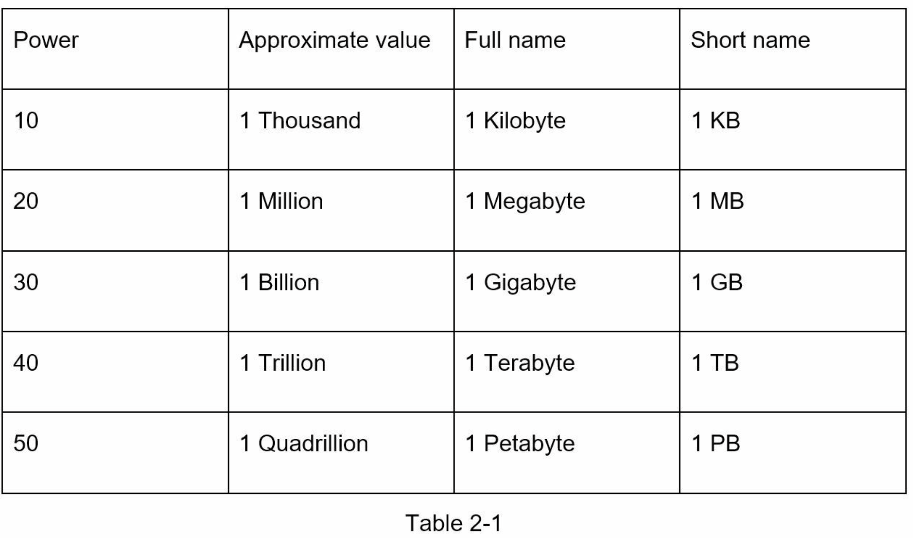

## Chapter 2: BACK-OF-THE-ENVELOPE ESTIMATION

Back-of-the-envelope calculations are estimates you are create using a combination of thought experiments and common performance number s to get a good feel for which design will meet your requirements.

You always need to understand scalability to successfully perform back-of-the-envelop estimations. The following concepts should be well understood:
1. Power of two
2. Latency numbers every programmer should know.
3. Availability numbers

## Power of two
Although data volume can become enormous when dealing with distributed systems, calculations always boils down to the basics. To obtain correct calculations, it is critical to know the data volume unit using the power of two.

A byte is a sequence of 8 bits. An ASCII character uses one byte of memory (8 bits). Below is a table explaining the data volume unit (Table 2- 1).

## Latency numbers every programmer should know